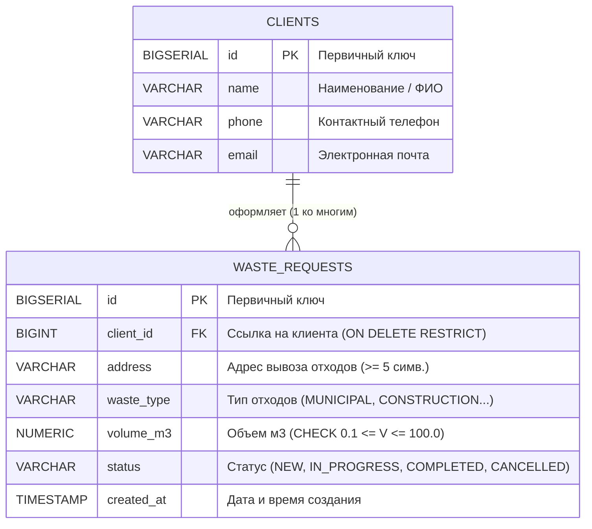
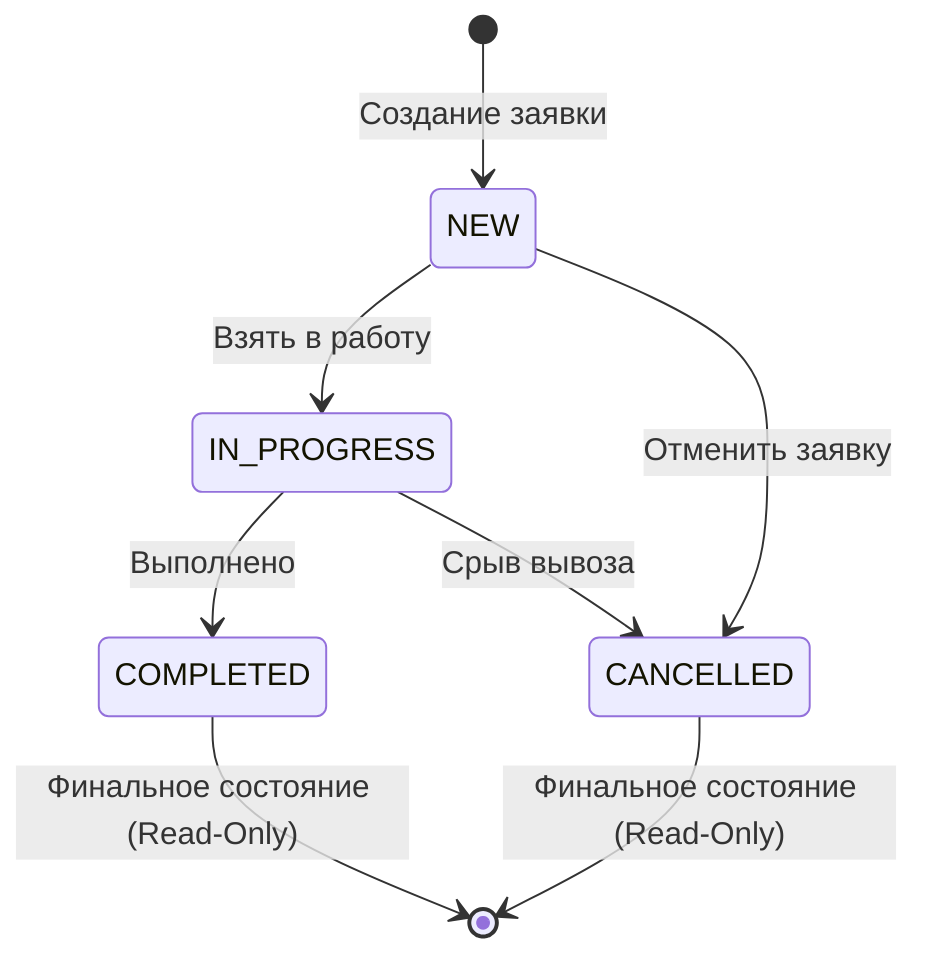

# Архитектурный отчет: Система учета заявок на вывоз отходов

## 1. Архитектурный стиль и принципы

Система построена на принципах **многослойной архитектуры (Layered Architecture)**, соблюдении **SOLID** и контрактно-ориентированном проектировании (**Interface-Based Programming**). 

Все слои взаимодействуют исключительно через интерфейсы. Внедрение зависимостей осуществляется вручную через конструкторы в точке входа (`Main.java`), что гарантирует слабую связность компонентов (**Loose Coupling**) и возможность изолированного модульного тестирования без запуска СУБД.

---

## 2. Диаграмма слоев и потоков данных (Component Diagram)

```mermaid
flowchart TD
    subgraph UI ["1. Слой представления (Presentation Layer)"]
        Menu["ConsoleMenu\n(Цикл меню, перехват исключений)"]
        Reader["InputReader\n(Защита Scanner, нормализация запятых)"]
        Menu --> Reader
    end

    subgraph ServiceLayer ["2. Слой бизнес-логики (Service Layer)"]
        Service["WasteRequestService\n(5 бизнес-правил, Stream API)"]
        Calc["VolumeCalculator\n(Расчет по габаритам и таре)"]
        Exporter["ExcelExporter\n(Apache POI, защита от блокировки файлов)"]
        Stats["WasteRequestStats\n(DTO агрегированной аналитики)"]
        
        Service -.-> Stats
        Reader --> Calc
    end

    subgraph PersistenceLayer ["3. Слой доступа к данным (Persistence Layer)"]
        CrudRepo["«interface»\nCrudRepository<T, ID>"]
        ClientRepo["«interface»\nClientRepository"]
        RequestRepo["«interface»\nWasteRequestRepository"]
        
        JdbcClient["JdbcClientRepository\n(PreparedStatement, try-with-resources)"]
        JdbcRequest["JdbcWasteRequestRepository\n(JOIN, маппинг SQLState 23503)"]

        ClientRepo --|> CrudRepo
        RequestRepo --|> CrudRepo
        JdbcClient ..|> ClientRepo
        JdbcRequest ..|> RequestRepo
    end

    subgraph InfraLayer ["4. Инфраструктура и СУБД (Infrastructure Layer)"]
        DBM["DatabaseManager\n(Singleton, Twelve-Factor Config)"]
        Postgres[("PostgreSQL 18\n(schema.sql / data.sql)")]
        
        DBM --> Postgres
        JdbcClient --> DBM
        JdbcRequest --> DBM
    end

    Menu --> Service
    Menu --> Exporter
    Menu --> ClientRepo
    Service --> RequestRepo
    Service --> ClientRepo
```

---

## 3. Модель данных (ER-Диаграмма)



---

## 4. Конечный автомат статусов (FSM State Diagram)



---

## 5. Примененные паттерны проектирования

| Паттерн | Реализация в проекте | Зачем нужен (ответ для комиссии) |
| :--- | :--- | :--- |
| **Repository** | `CrudRepository`, `JdbcClientRepository`, `JdbcWasteRequestRepository` | Полная изоляция бизнес-логики от SQL-запросов и диалектов СУБД. |
| **Dependency Injection (Manual)** | Конструкторы в `Main.java` | Устранение жесткой связности (Loose Coupling) без оверхеда фреймворков. |
| **Singleton** | `DatabaseManager.getInstance()` | Гарантия единственной точки конфигурации и пула соединений. |
| **Finite State Machine (FSM)** | `RequestStatus.canTransitionTo()` | Инкапсуляция графа допустимых состояний внутри доменного перечисления. |
| **Data Transfer Object (DTO)** | `WasteRequestStats` | Передача агрегированных расчетных данных между сервисом и UI. |
